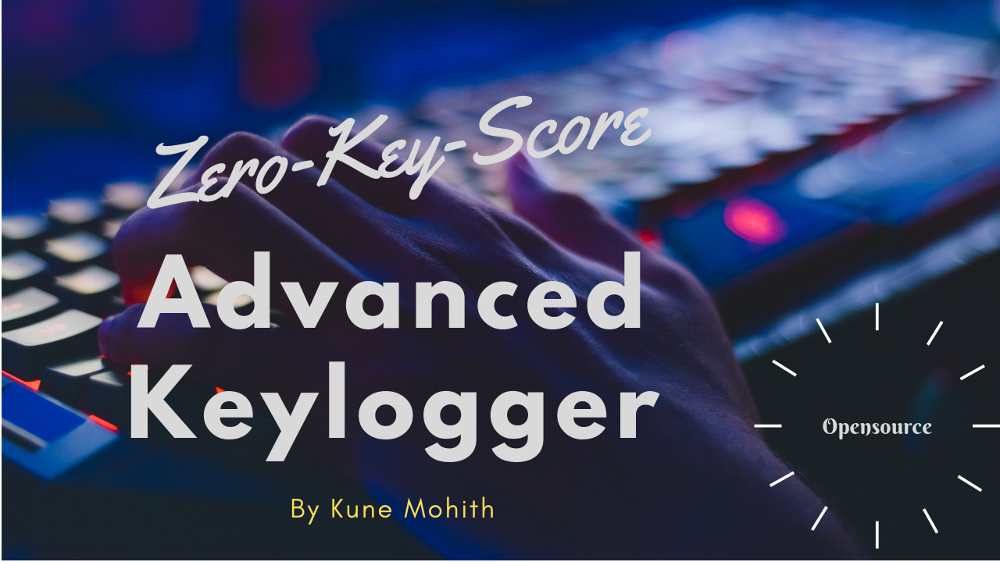

# zero-key-score
[](https://opensource.org/licenses/mit-license.php)




#### Show some :heart: and star the repo to support the project

##### Youtube Video link: [watch](https://www.youtube.com/watch?v=HZDWXQQlgcs)

##### My Website link: [My Website](https://kunemohith.github.io)

<!-- If you like the repository, support the Developer by staring the repo and buying me a Coffee<br>

<a href="https://www.buymeacoffee.com/kunemohith" target="\_blank"></a> -->


## Intro
Welcome to the zero-key-score repository! A Python3 program that records your keystrokes and the clipboard, and this program saves them in log files in `/tmp` folder on your local computer. And periodically posts them to a Google form for post analysis purposes.

Check out below to learn how to install them. The zero-key-score is besides being simple and handy it also works like charm! Feel free to fork and improve it if you want. Be sure to check out the issues or pull requests to see if your problem has been fixed, or to help out others.

Please Star and Share the Repo if it helped you!

I strongly believe this,
> “*Information should be free”. <br>
-One of the principles of Hacking*

[NOTE] This project uses python3<br>
[NOTE] This projects works on Linux only.

---
## Instructions to use
This project has two major dependencies.
  1. pyxhook
  2. pyperclip

First before running the main script. You need to install those packages.

```bash
pip3 install -r requirements.txt
```
You may need to run the above command with ```sudo``` depending on the permissions the user permissions.

[NOTE] If the `pyperclip` doesn't work on your distro do this,
```bash
sudo apt install xsel
```

There are few things to be changed in the ```src/zero-key-score.py``` file according to your needs.
  1. Change Google Form URL. Visit the example url in program and create similar one.
  ```python3
  google_form_url = <New Form URL>
  ```
    [NOTE] When you create a new Google form the url will look like `https://docs.google.com/forms/d/e/<random_chars_and_numbers>/viewform`.
    But, the url must look like `https://docs.google.com/forms/d/e/<random_chars_and_numbers>/formResponse`.
    The `viewform` should be replcaced with `formResponse`.
    
  2. Change the time to wait before posting to google form
  ```python3
  wait_time_to_post = <new time>
  ```
  3. wait_time_to_listen_clip = <Time to wait before reading the copied content>(sec)
  ```python3
  wait_time_to_listen_clip = <new time>
  ```

Finally, you can run the program by following the below commands
```bash
# Change directory to the src/
cd <path>/zero-key-score/src

# Make the program executable
chmod +x zero-key-score.py

# Run the script
./zero-key-score.py
```

Conversely, you can also run the program without making it as an executable.
```bash
python3 zero-key-score.py
```

---
## How the Script works?
Variables in this script:
  1. `logs_keys_file` stores the captures keys into it.

  2. `log_clip_file` stores the copied content into it.

  3. `google_form_url` is the google form URL to which the content of `logs_keys_file` and `log_clip_file` are posted.

  4. `wait_time_to_post` and `wait_time_to_listen_clip` as already told are the wait times used to sleep by the processes.

Functions in this script:
  1. `initialize_files()` -> Initialize the locks and logs the current timestamp into both files `logs_keys_file` and `log_clip_file`.

  2. `listen_key()` -> Listens to the keys constantly with the helper function `OnKeyPress(event)` and writes into the `logs_keys_file`.

  3. `listen_key()` -> Listens to the clipboard and writes in the `log_clip_file`.

  4. `get_private_ip()` -> To get the private IP of the computer. Public IP is also collected and posted to the Google form (see `post_form()`'s code for more details).

  5. `post_form()`  -> Posts the content from the both files to the provided google form url.


### Workflow
  1. There are three different process in the script.
    1. `p1` -> Captures the key strokes
    2. `p2` -> Captures the copied content from clipboard
    3. `p3` -> Post the content collected by `p1`, `p2` to the Google form.


  2. There are two Locks for `logs_keys_file` & `log_clip_file` are used to provide syncronization.

  3. When the program starts the three processes start doing their thing.

  4. Firstly, `p1` the keystrokes are continuously captured in livetime and stored in the `logs_keys_file`.

  5. Secondly, `p2` reads the copied content from the clipboard and writes into the `log_clip_file`. And then sleeps for `wait_time_to_listen_clip` seconds before repeating itself again.

  6. Note that the log files are created in the `/tmp` directory in order not to be suspicious. Because, `/tmp` files are deleted after every reboot.

  7. Nextly, `p3` waits for `wait_time_to_post` and then posts the content of `logs_keys_file` and `log_clip_file` to the `google_form_url`. And repeats itself.

  8. The Program never stops by itself. You can terminate the program by pressing `CTRL+C` in the terminal.
